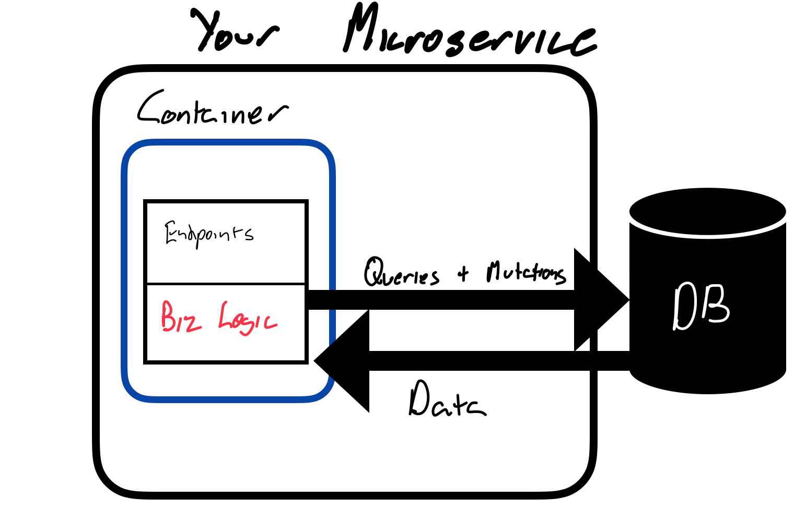

# Why Tuna

The need for scalable applications has been around for a long time, but it still requires effort and expertise to build scalable apps. It typically ends up looking like this:



While this looks simple on the surface, it frequently is not. Complexity creeps in in many places. If you've built an app from scratch, you've likely had to cobble together Dockerfiles, build systems, containers, web servers, ORMs, and databases just to build some microservices.

This is where Tuna comes in. The goal of Tuna is to make microservice development as simple as possible. Given this goal, the following requirements emerge:
- Persisted and shared global state.
- NoQL: Developers should not have to use any query language to work with global state. This eliminates the need for developers to learn a query language.
- Easily define endpoints to expose business logic.
- Security primitives to easily secure endpoints.
- Gradual typing: Developers should be able to rapidly prototype and define types later.

As a result, developing scalable services in tuna is dramatically simplified. Developers may write code as if they have a [single system image](https://en.wikipedia.org/wiki/Single_system_image).

## Future Opportuntities
Looking ahead, a lot of exciting technical opportunities remain for Tuna:

### Static Analysis
Static analysis of Tuna can provide many interesting summaries. Tuna may be easily statically analyzed because Tuna compiles to the [Conder Intermediate Representation](https://github.com/Conder-Systems/conder). The intermediate representation is essentially a way to describe computations against global state and local state. This intermediate representation doesn't leak extra information like connecting to a database and query languages and is just JSON, it can be summarized easily.

#### Capability Summary
Tuna can be reduced to a capability summary, a short description of what each role is capable of. Something like this is perfectly feasible:

Given code:

```
role user {
    name: string
}

const users = {}
...
user func delete() {
    users[caller.name].delete()
}

pub func delete(name) {
    users[name].delete()
}

```
We could summarize this to: 
```
a user may: 
    - delete
        - the value in users associated with the user's name
anyone may:
    - delete
        - any user
```

These summaries could be useful for ensuring that permissions are not unintentionally granted as code bases scale in size.

#### Stale State Warnings

Tuna could also warn users when they are performing some operation with stale state. Sometimes we are okay with using stale state. 
Othertimes, we are definitely not. Consider:

```
const payments = {}
func process_payment(id) {
    const payment = payments[id]
    if payment.pending {
        ..send money
        payments[id].pending = false
    }
}
```
Stale state is used to make a literally costly decision here. Warning about conditions like this at compile time could reduce the number of race conditions in production.

### Data, Parallelism, and Performance Transparency
Data transparency means users don't know and are not concerned with where or how data is stored. This unlocks opportunities for optimization of microservices such as tiering cold data, caching hot data, and creating indexes. 
Similarly, the parallelism transparency means execution of code is automatically parallelized. While Tuna doesn't have parallelism transparency today, the hope is to incrementally introduce it. One opporunitity for this is when some action is performed over very large datasets. For example:

```
...
for id in pending_payments.keys() {
    complete_payment(id)
}
...
```
Rather than loading the keys for all pending payments into memory on a single node and sequentially completing each payment. The dataset can be shared across many nodes and the payments can be performed in parallel.

These are optimizations that microservice developers manually implement, but in tuna it would be possible to automatically apply optimizations.

### Portability
One benefit of abstracting away query languages is that multiple underlying databases can be supported. If a user wanted to move their application from one database to another, they could do so without modifying any of their application code.


## Challenges

As Tuna grows in complexity, the challenge will be achieving performance equivalent to systems built by a developer making economical use of their query language. This challenge can be overcome by building a query planner into the compiler. Query planners exist in distributed query engines like Dremio or Presto. However, they are built to efficiently execute one query. The goal of the Tuna/Conder query planner would be to collapse actions against global state into the fewest number of requests possible.

